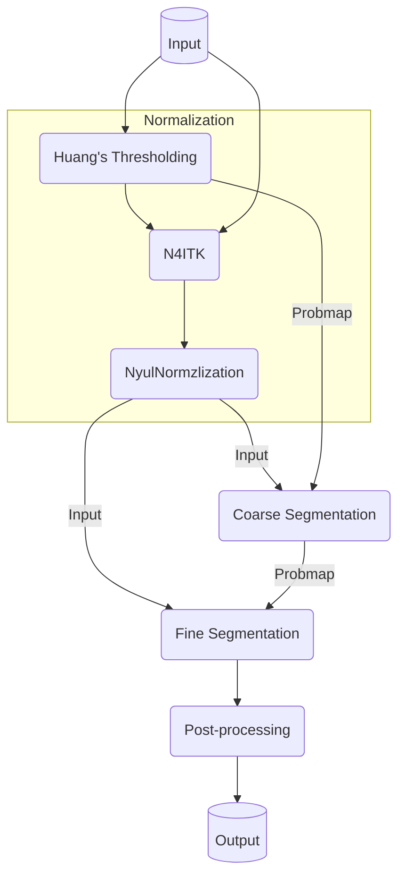

# Intro

This project is written to reuse an old checkpoint for segmentation of NPC on MRI. 

# Install

## Pre-requisits

### Torchio (my fork)

```bash
pip install git+https://github.com/alabamagan/torchio
```

### Pytorch  Medical Imaging

Note that this repo is private 

```bash
git clone 
cd pytorch-medical-imaging
python setup.py build_ext 
pip install .
```

# Pipeline

The pipeline of the algorithms is the same as ReportGen software, which consist first of coarse segmentation and then a fine segmentation process:



# Important

To run this project correctly you must use the dedicated forked version of `torchio` because the current implementation of `CallBackQueue` is a `tio.Queue` and it relies on some special mechanism I implemented. This `includes returning the patch draw position...etc. 